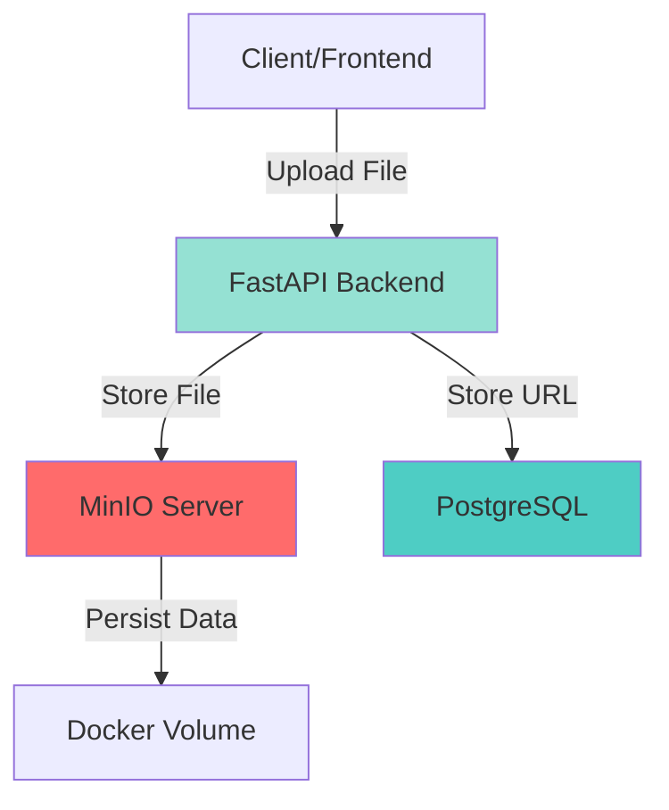
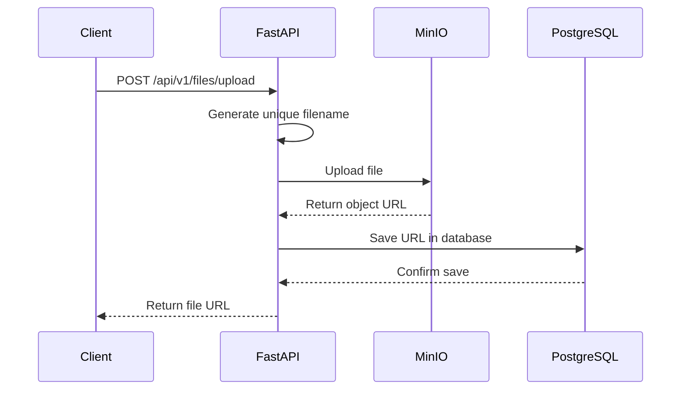

# MinIO Object Storage Integration Guide

Complete guide for MinIO S3-compatible object storage in the LMS backend.

---

## 📋 Table of Contents

1. [What is MinIO?](#what-is-minio)
2. [Object Storage Concepts](#object-storage-concepts)
3. [Architecture Overview](#architecture-overview)
4. [Getting Started](#getting-started)
5. [File Upload Flow](#file-upload-flow)
6. [API Endpoints](#api-endpoints)
7. [Database Integration](#database-integration)
8. [Security Best Practices](#security-best-practices)
9. [Production Considerations](#production-considerations)

---

## 🎯 What is MinIO?

**MinIO** is a high-performance, S3-compatible object storage system. It's:

- **Open Source**: Free and community-driven
- **S3 Compatible**: Works with AWS S3 SDKs and tools
- **Cloud Native**: Designed for Kubernetes and containers
- **High Performance**: Optimized for large-scale data workloads
- **Self-Hosted**: Run on your own infrastructure

### Why MinIO for LMS?

✅ **Scalability**: Handle millions of files without database bloat  
✅ **Cost Effective**: No cloud storage fees for development/on-premise  
✅ **S3 Compatible**: Easy migration to AWS S3 if needed  
✅ **Better Performance**: Optimized for file storage vs database BLOBs  
✅ **Clean Architecture**: Separation of concerns (files vs metadata)

---

## 📦 Object Storage Concepts

### What is Object Storage?

Object storage stores data as **objects** rather than files in a hierarchy or blocks on disk.

**Each object contains:**
- **Data**: The actual file content
- **Metadata**: Information about the file (size, type, timestamps)
- **Unique ID**: Object name/key for retrieval

### Key Concepts

#### 1. **Bucket**
A container for storing objects (like a top-level folder).

```
lms-files/          ← Bucket
├── notes/          ← Folder (prefix)
├── assignments/
├── submissions/
└── media/
```

#### 2. **Object Name (Key)**
Unique identifier for each file within a bucket.

```
notes/550e8400-e29b-41d4-a716-446655440000_lecture.pdf
│     │                                      │
│     └─ UUID (ensures uniqueness)          └─ Original filename
└─ Folder prefix
```

#### 3. **Object URL**
Public or presigned URL to access the file.

```
http://localhost:9000/lms-files/notes/550e8400-e29b-41d4-a716-446655440000_lecture.pdf
│                     │         │
│                     │         └─ Object name
│                     └─ Bucket
└─ MinIO endpoint
```

---

## 🏗️ Architecture Overview

### System Components



### Data Flow



### How LMS Uses MinIO

| Feature | Folder | Example |
|---------|--------|---------|
| **Course Notes** | `notes/` | Lecture PDFs, study materials |
| **Assignments** | `assignments/` | Assignment PDFs, instructions |
| **Student Submissions** | `submissions/` | Student work, projects |
| **Media Files** | `media/` | Videos, images, audio |
| **Resources** | `resources/` | Additional learning materials |

---

## 🚀 Getting Started

### 1. Start Services

```bash
# Start PostgreSQL and MinIO
docker compose up -d

# Verify services are running
docker ps

# Expected output:
# lms_postgres  (port 5432)
# lms_minio     (ports 9000, 9001)
```

### 2. Access MinIO Console

Open browser: **http://localhost:9001**

**Login Credentials:**
- Username: `minioadmin`
- Password: `minioadmin`

### 3. Install Python Dependencies

```bash
# Install minio package
pip install -r requirements.txt

# Or using uv
uv pip install -r requirements.txt
```

### 4. Configure Environment

Update `.env` file:

```bash
# MinIO Configuration
MINIO_ENDPOINT=localhost:9000
MINIO_ACCESS_KEY=minioadmin
MINIO_SECRET_KEY=minioadmin
MINIO_BUCKET_NAME=lms-files
MINIO_SECURE=false
MINIO_URL_EXPIRY=3600
```

### 5. Start FastAPI Server

```bash
uv run uvicorn app.main:app --reload
```

### 6. Test File Upload

Open Swagger UI: **http://localhost:8000/docs**

Navigate to: **POST /api/v1/files/upload**

---

## 📤 File Upload Flow

### Complete Process

```
1. User uploads file
   ↓
2. FastAPI receives UploadFile
   ↓
3. Generate unique filename (UUID + original name)
   ↓
4. Upload to MinIO bucket
   ↓
5. Get file URL from MinIO
   ↓
6. Store URL in PostgreSQL
   ↓
7. Return URL to client
```

### Code Example

```python
from fastapi import UploadFile
from app.core.storage import get_minio_client

async def create_note_with_file(file: UploadFile):
    # 1. Upload file to MinIO
    minio_client = get_minio_client()
    result = await minio_client.upload_file(file, folder="notes")
    
    # 2. Store URL in database
    note = Note(
        title="Lecture 1",
        content_url=result['file_url'],  # ← Store URL, not file!
        size=result['size']
    )
    db.add(note)
    await db.commit()
    
    # 3. Return to client
    return {
        "note_id": note.id,
        "file_url": result['file_url']
    }
```

---

## 🔌 API Endpoints

### 1. Upload File

**Endpoint:** `POST /api/v1/files/upload`

**Request:**
```bash
curl -X POST "http://localhost:8000/api/v1/files/upload?folder=notes" \
  -H "Content-Type: multipart/form-data" \
  -F "file=@lecture.pdf"
```

**Response:**
```json
{
  "object_name": "notes/550e8400-e29b-41d4-a716-446655440000_lecture.pdf",
  "file_url": "http://localhost:9000/lms-files/notes/550e8400-e29b-41d4-a716-446655440000_lecture.pdf",
  "bucket": "lms-files",
  "size": 1048576,
  "content_type": "application/pdf"
}
```

### 2. Generate Presigned URL

**Endpoint:** `POST /api/v1/files/presigned-url`

**Request:**
```json
{
  "object_name": "notes/550e8400-e29b-41d4-a716-446655440000_lecture.pdf",
  "expiry": 3600
}
```

**Response:**
```json
{
  "url": "http://localhost:9000/lms-files/notes/file.pdf?X-Amz-Algorithm=AWS4-HMAC-SHA256&...",
  "object_name": "notes/550e8400-e29b-41d4-a716-446655440000_lecture.pdf",
  "expiry": 3600
}
```

### 3. Get File Info

**Endpoint:** `GET /api/v1/files/info/{object_name}`

**Response:**
```json
{
  "object_name": "notes/550e8400-e29b-41d4-a716-446655440000_lecture.pdf",
  "size": 1048576,
  "last_modified": "2026-02-16T12:00:00Z",
  "content_type": "application/pdf",
  "etag": "d41d8cd98f00b204e9800998ecf8427e"
}
```

### 4. Delete File

**Endpoint:** `DELETE /api/v1/files/{object_name}`

**Response:** `204 No Content`

---

## 💾 Database Integration

### ❌ Wrong Approach: Storing Files in Database

```python
# DON'T DO THIS!
class Note(Base):
    __tablename__ = "notes"
    id = Column(Integer, primary_key=True)
    title = Column(String)
    file_data = Column(LargeBinary)  # ❌ Stores entire file in DB
```

**Problems:**
- Database bloat (GBs of binary data)
- Slow queries and backups
- Memory issues
- Poor scalability

### ✅ Correct Approach: Storing URLs

```python
# DO THIS!
class Note(Base):
    __tablename__ = "notes"
    id = Column(Integer, primary_key=True)
    title = Column(String)
    content_url = Column(String)  # ✅ Stores only URL
    file_size = Column(Integer)
    content_type = Column(String)
```

**Benefits:**
- Lightweight database
- Fast queries
- Scalable storage
- Easy file management

### Integration Example

#### Update Note Model

```python
# app/features/courses/models.py

class LearningMaterial(Base):
    __tablename__ = "learning_materials"
    
    id = Column(Integer, primary_key=True)
    title = Column(String, nullable=False)
    description = Column(Text)
    
    # MinIO integration
    content_url = Column(String)  # File URL from MinIO
    file_size = Column(Integer)   # File size in bytes
    content_type = Column(String)  # MIME type
    object_name = Column(String)   # Object name in MinIO (for deletion)
    
    course_id = Column(Integer, ForeignKey("courses.id"))
    created_at = Column(DateTime, default=datetime.utcnow)
```

#### Update Creation Flow

```python
# app/features/courses/service.py

async def create_learning_material(
    db: AsyncSession,
    file: UploadFile,
    title: str,
    course_id: int
):
    # 1. Upload to MinIO
    minio_client = get_minio_client()
    upload_result = await minio_client.upload_file(file, folder="notes")
    
    # 2. Create database record
    material = LearningMaterial(
        title=title,
        content_url=upload_result['file_url'],
        file_size=upload_result['size'],
        content_type=upload_result['content_type'],
        object_name=upload_result['object_name'],
        course_id=course_id
    )
    
    db.add(material)
    await db.commit()
    await db.refresh(material)
    
    return material
```

#### Update Deletion Flow

```python
async def delete_learning_material(db: AsyncSession, material_id: int):
    # 1. Get material from database
    material = await db.get(LearningMaterial, material_id)
    
    # 2. Delete file from MinIO
    minio_client = get_minio_client()
    minio_client.delete_file(material.object_name)
    
    # 3. Delete database record
    await db.delete(material)
    await db.commit()
```

---

## 🔒 Security Best Practices

### 1. Public vs Private Buckets

#### Public Bucket
Files are accessible to anyone with the URL.

**Use for:**
- Public course materials
- Marketing content
- Open educational resources

**Configuration:**
```python
# Set bucket policy to public
minio_client.client.set_bucket_policy(
    bucket_name="public-files",
    policy=json.dumps({
        "Version": "2012-10-17",
        "Statement": [{
            "Effect": "Allow",
            "Principal": {"AWS": ["*"]},
            "Action": ["s3:GetObject"],
            "Resource": [f"arn:aws:s3:::public-files/*"]
        }]
    })
)
```

#### Private Bucket (Recommended)
Files require authentication or presigned URLs.

**Use for:**
- Student submissions
- Graded assignments
- Private course materials
- Personal documents

**Default behavior** - no additional configuration needed!

### 2. Presigned URLs

**What are they?**
Temporary URLs that grant time-limited access to private files.

**When to use:**
- ✅ Authenticated user downloads
- ✅ Temporary file sharing
- ✅ Secure document access
- ✅ Time-limited resources

**Example:**
```python
# Generate 1-hour presigned URL
url = minio_client.generate_presigned_url(
    object_name="submissions/student_assignment.pdf",
    expiry=3600  # 1 hour
)

# URL expires after 1 hour - perfect for secure downloads!
```

### 3. Access Control

```python
from app.features.auth.dependencies import get_current_user

@router.post("/files/upload")
async def upload_file(
    file: UploadFile,
    current_user: User = Depends(get_current_user)  # ← Require auth
):
    # Only authenticated users can upload
    ...
```

### 4. File Validation

```python
ALLOWED_EXTENSIONS = {".pdf", ".docx", ".jpg", ".png", ".mp4"}
MAX_FILE_SIZE = 50 * 1024 * 1024  # 50 MB

async def validate_file(file: UploadFile):
    # Check extension
    ext = os.path.splitext(file.filename)[1].lower()
    if ext not in ALLOWED_EXTENSIONS:
        raise HTTPException(400, "File type not allowed")
    
    # Check size
    content = await file.read()
    if len(content) > MAX_FILE_SIZE:
        raise HTTPException(400, "File too large")
    
    await file.seek(0)  # Reset file pointer
```

### 5. Environment Security

> [!CAUTION]
> **Never commit credentials to version control!**

```bash
# .env (NOT in git)
MINIO_ACCESS_KEY=your-secret-key
MINIO_SECRET_KEY=your-secret-password

# .gitignore
.env
```

---

## 🌐 Production Considerations

### 1. Bucket Versioning

Keep multiple versions of files to prevent data loss.

```python
# Enable versioning
minio_client.client.set_bucket_versioning(
    bucket_name="lms-files",
    config=VersioningConfig(status="Enabled")
)
```

**Benefits:**
- Recover deleted files
- Restore previous versions
- Audit trail

### 2. Object Lifecycle Policies

Automatically delete old files to save storage.

```python
from datetime import timedelta
from minio.lifecycleconfig import LifecycleConfig, Rule, Expiration

# Delete files older than 90 days
config = LifecycleConfig([
    Rule(
        rule_id="delete-old-submissions",
        status="Enabled",
        expiration=Expiration(days=90),
        rule_filter={"prefix": "submissions/"}
    )
])

minio_client.client.set_bucket_lifecycle(
    bucket_name="lms-files",
    config=config
)
```

### 3. Scaling MinIO

#### Single Server (Development)
```yaml
# docker-compose.yml
minio:
  image: minio/minio:latest
  command: server /data
```

#### Distributed Mode (Production)
```yaml
# docker-compose.yml
minio1:
  image: minio/minio:latest
  command: server http://minio{1...4}/data{1...2}
  
minio2:
  image: minio/minio:latest
  command: server http://minio{1...4}/data{1...2}
  
# ... minio3, minio4
```

**Benefits:**
- High availability
- Automatic failover
- Horizontal scaling
- Erasure coding

### 4. CDN Integration

For global performance, use a CDN in front of MinIO.

```
Client → CloudFlare CDN → MinIO
```

**Benefits:**
- Faster downloads worldwide
- Reduced MinIO load
- DDoS protection
- Caching

### 5. Monitoring

```python
# Health check endpoint
@app.get("/health/minio")
async def minio_health():
    try:
        minio_client = get_minio_client()
        minio_client.client.bucket_exists("lms-files")
        return {"status": "healthy"}
    except:
        return {"status": "unhealthy"}
```

### 6. Backup Strategy

```bash
# Backup MinIO data
docker run --rm \
  -v minio_data:/data \
  -v $(pwd)/backups:/backups \
  alpine tar czf /backups/minio-backup-$(date +%Y%m%d).tar.gz /data
```

---

## 🏢 Why Companies Use MinIO

### Real-World Use Cases

1. **Media Streaming Platforms**
   - Store millions of videos
   - Serve content globally
   - Cost-effective at scale

2. **Educational Institutions**
   - Student submissions
   - Course materials
   - Video lectures
   - Research data

3. **Healthcare**
   - Medical imaging (DICOM)
   - Patient records
   - Compliance (HIPAA)

4. **Financial Services**
   - Document storage
   - Audit logs
   - Regulatory compliance

### MinIO vs Alternatives

| Feature | MinIO | AWS S3 | Azure Blob |
|---------|-------|--------|------------|
| **Cost** | Free (self-hosted) | Pay per GB | Pay per GB |
| **Control** | Full control | Limited | Limited |
| **S3 Compatible** | ✅ Yes | ✅ Yes | ❌ No |
| **On-Premise** | ✅ Yes | ❌ No | ❌ No |
| **Open Source** | ✅ Yes | ❌ No | ❌ No |

---

## 📚 Additional Resources

- [MinIO Documentation](https://min.io/docs/minio/linux/index.html)
- [MinIO Python SDK](https://min.io/docs/minio/linux/developers/python/minio-py.html)
- [S3 API Reference](https://docs.aws.amazon.com/AmazonS3/latest/API/Welcome.html)

---

## 🎓 Summary

You now have a complete MinIO integration that:

✅ Stores files in S3-compatible object storage  
✅ Generates unique filenames to prevent conflicts  
✅ Returns public URLs for file access  
✅ Supports presigned URLs for secure downloads  
✅ Integrates cleanly with PostgreSQL  
✅ Follows production best practices  
✅ Scales to millions of files  

**Next Steps:**
1. Start Docker services: `docker compose up -d`
2. Access MinIO Console: http://localhost:9001
3. Test file upload via Swagger: http://localhost:8000/docs
4. Integrate with your Notes/Assignments features
5. Implement file validation and access control
